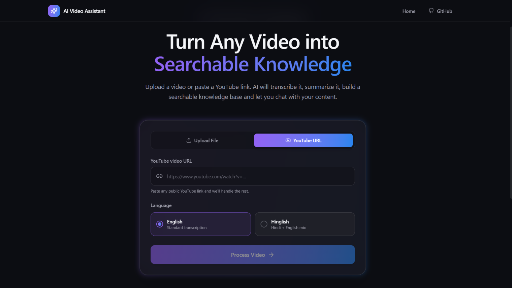
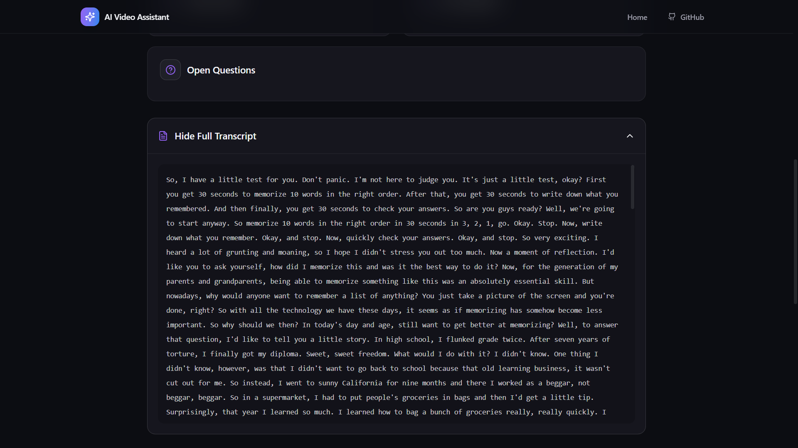
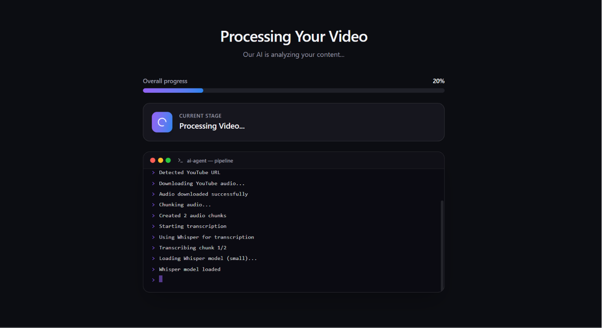
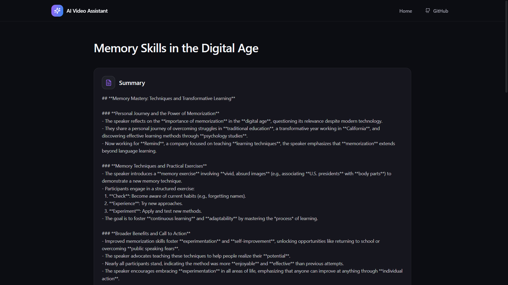
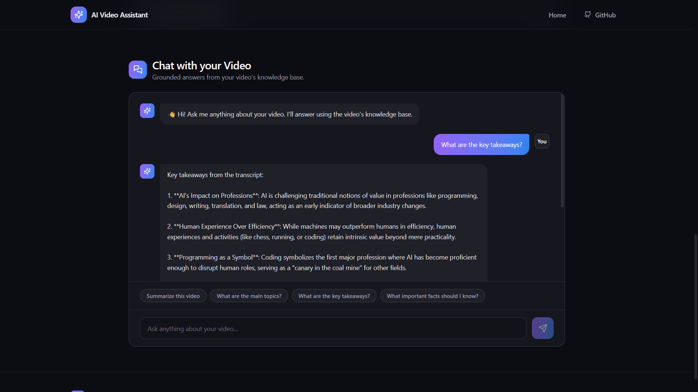

# 🎥 AI Video Assistant

An AI-powered Video Intelligence Platform that transforms YouTube videos and uploaded media into structured knowledge.

The application automatically transcribes videos, generates concise summaries, extracts action items, key decisions, and open questions, builds a Retrieval-Augmented Generation (RAG) knowledge base, and enables users to chat with their videos using natural language.

---

## ✨ Features

- 📺 Process YouTube videos by simply pasting a URL
- 📁 Upload local video/audio files
- 🎙️ Automatic speech-to-text transcription using Whisper
- 📝 AI-generated structured summaries
- ✅ Automatic Action Item extraction
- 💡 Key Decision extraction
- ❓ Open Question identification
- 🧠 Retrieval-Augmented Generation (RAG) powered chat
- 💬 Conversational Q&A grounded on the processed video
- 📊 Real-time processing progress
- 💻 Modern responsive UI with dark/light mode

---

## Demo

## Landing Page



---

## TRanscript


## Processing Pipeline



---

## Dashboard



---

## Chat Interface




---

# Tech Stack

## Frontend

- React
- TypeScript
- Tailwind CSS
- Framer Motion
- Axios
- React Router

## Backend

- FastAPI
- Python

## AI Stack

- Whisper
- Mistral AI
- LangChain
- ChromaDB
- HuggingFace Embeddings

---

# Architecture

```
                 YouTube URL / Upload
                         │
                         ▼
                Audio Processing
                         │
                         ▼
                  Speech-to-Text
                     (Whisper)
                         │
                         ▼
              Transcript Generation
                         │
       ┌─────────────────┼─────────────────┐
       ▼                 ▼                 ▼
   Summary        Action Items       Key Decisions
                         │
                         ▼
                Build Vector Store
                  (ChromaDB)
                         │
                         ▼
                  Retrieval Chain
                         │
                         ▼
                  Chat Interface
```

---

# Project Structure

```
Video-Agent/
│
├── frontend/
│
├── core/
│   ├── transcriber.py
│   ├── summarizer.py
│   ├── extractor.py
│   └── rag_engine.py
│
├── services/
│
├── utils/
│
├── uploads/
├── downloads/
├── vector_db/
│
├── app.py
├── requirements.txt
└── README.md
```

---

# Installation

## Clone Repository

```bash
git clone https://github.com/yourusername/Video-Agent.git
cd Video-Agent
```

## Create Virtual Environment

```bash
python -m venv .venv
```

Activate

### Windows

```bash
.venv\Scripts\activate
```

### Linux / Mac

```bash
source .venv/bin/activate
```

Install dependencies

```bash
pip install -r requirements.txt
```

---

# Environment Variables

Create a `.env` file in the root directory.

```env
MISTRAL_API_KEY=YOUR_API_KEY

SARVAM_API_KEY=YOUR_API_KEY

WHISPER_MODEL=small
```

---

# Run Backend

```bash
uvicorn app:app --reload
```

---

# Run Frontend

```bash
cd frontend

npm install

npm run dev
```

---

# API Endpoints

| Method | Endpoint | Description |
|---------|----------|-------------|
| POST | `/process` | Process YouTube URL |
| POST | `/upload` | Upload Local Video |
| GET | `/status/{job_id}` | Check Processing Status |
| POST | `/chat` | Chat with Processed Video |

---

# Workflow

1. Upload a video or paste a YouTube URL.
2. Audio is extracted and preprocessed.
3. Whisper generates the transcript.
4. Mistral AI creates a structured summary.
5. AI extracts:
   - Action Items
   - Key Decisions
   - Open Questions
6. Transcript is embedded into ChromaDB.
7. Users interact with the video through a RAG-powered chatbot.

---

# Tech Highlights

- Retrieval-Augmented Generation (RAG)
- Vector Search
- Semantic Retrieval
- Background Task Processing
- AI-powered Information Extraction
- Responsive Modern UI

---

# Author

**Nafis**

GitHub: https://github.com/Nafis42

